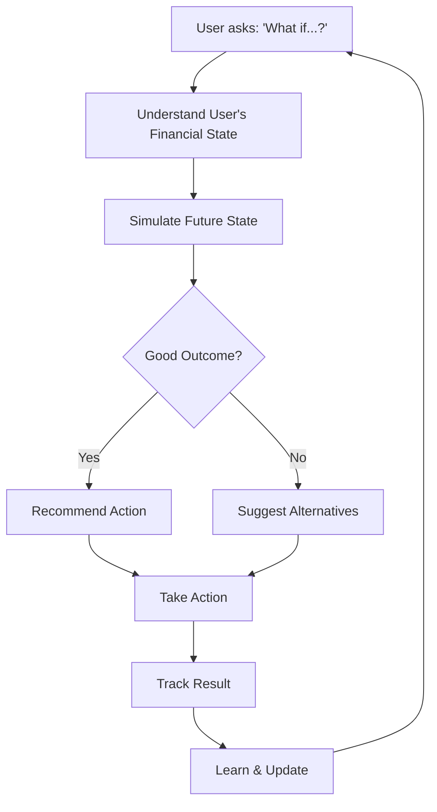
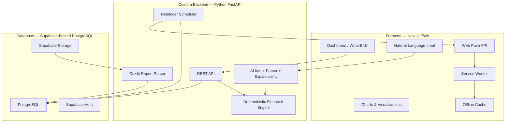
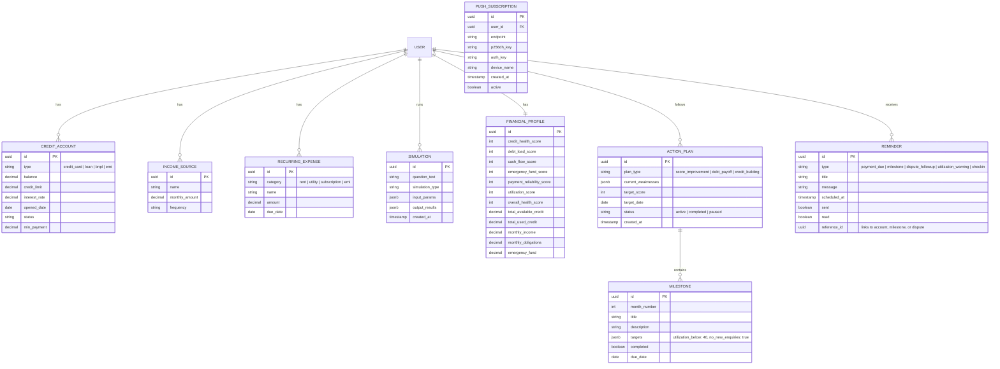

# CreditIn (Credin) — Implementation Plan

> **Hackathon:** Code Build 1.0 (CoBuild) — Team Zero
> **Status:** Pre-development — awaiting feedback before any code is written.
> **Source:** [gpt.txt](./gpt.txt), README, Pitch Deck

---

## 1. Product Summary

> *Your credit score tells you what happened. CreditIn tells you what happens next.*

**CreditIn** is a financial "What-If" engine for smarter decisions — a hackathon project for Code Build 1.0.

Rather than passively showing a credit score, the product lets users **simulate** financial decisions (pay debt, take a loan, close a card, buy a car) and see the **projected impact** on their credit health, cash flow, and overall financial wellbeing — before they act.

**Market context (from pitch deck):**
- 89 crore credit-eligible consumers in India
- 74% are currently credit-active (up from 35% in 2017)
- 15% of originations classified as over-leveraged in FY2026
- Users see EMI — they don't see total debt load, cash-flow impact, or true cost

### Core Product Loop



---

## 2. Features (15 Total)

Features are grouped by the three product layers, plus a cross-cutting reminder system.

### Layer 1 — UNDERSTAND (Know your financial state)

| # | Feature | Description | Phase |
|---|---------|-------------|-------|
| 1 | **Financial Health Score** | A composite 0–100 score combining Credit Health, Debt Load, Cash Flow, Emergency Fund, Payment Reliability, and Credit Utilization — goes beyond just credit score | P1 |
| 2 | **Credit Report Detective** | Parse uploaded credit reports (CIBIL/Experian PDF) to detect duplicates, unexpected enquiries, status mismatches, and high utilization — auto-generate dispute information | P2 |
| 3 | **BNPL Tracker** | Aggregate hidden micro-debts (Amazon Pay Later, Flipkart Pay Later, Phone EMIs, Card EMIs) and show the combined monthly drain | P2 |
| 4 | **Rent + Recurring Payment Layer** | Connect rent, utilities, subscriptions — show total obligations as % of income | P3 |

### Layer 2 — SIMULATE (The What-If Engine)

| # | Feature | Description | Phase |
|---|---------|-------------|-------|
| 5 | **What-If Engine (Core)** | Natural-language question → structured simulation. Covers: pay debt, close card, take loan, buy asset, apply for card | P1 |
| 6 | **Debt Payoff Optimizer** | Compare Avalanche / Snowball / Credit-Optimized / Balanced strategies with interactive sliders showing timeline, interest saved, and credit health impact | P1 |
| 7 | **Loan Affordability Simulator** | Model true cost of a loan including EMI + total interest + impact on cash flow, DTI, emergency runway | P1 |
| 8 | **Asset Purchase Simulator** | Calculate true ownership cost (EMI + insurance + fuel + maintenance) — not just the sticker price | P2 |
| 9 | **Pre-Approval Odds** | Evaluate user profile against known product eligibility criteria and show approval likelihood + advise on timing (e.g., too many recent enquiries) | P3 |

### Layer 3 — ACT (Take informed action)

| # | Feature | Description | Phase |
|---|---------|-------------|-------|
| 10 | **CIBIL Score Improvement Plan** | Personalized, milestone-based roadmap to improve credit score — works for *everyone* (not just new users). Analyzes current weak spots (high utilization? thin file? late payments? too many enquiries?) and generates a month-by-month action plan with specific targets. Progress tracking with before/after projections. | P1 |
| 11 | **Emergency Fund Intelligence** | Before recommending "pay off debt," check if it would deplete emergency reserves below threshold and suggest a balanced approach | P1 |
| 12 | **Credit Protection / Watch** | Alerts for: new accounts, new enquiries, unusual changes, utilization spikes, approaching payments, status changes | P3 |
| 13 | **Dispute Workflow** | End-to-end dispute tracking from detection → generation of dispute info → status tracking → follow-up reminders | P3 |
| 14 | **Marketplace (Trust-first)** | Profile-matched product recommendations — including the option of "No product recommended right now" to build trust | P4 |

### Cross-cutting — REMINDERS & NUDGES

| # | Feature | Description | Phase |
|---|---------|-------------|-------|
| 15 | **Smart Reminders & Nudges** | A dedicated reminder engine that powers the entire app. Includes: **Payment due date reminders** (credit card bills, EMIs, loan payments — 3-day, 1-day, and due-day alerts), **Action plan milestones** ("This month: keep utilization below 40%"), **Dispute follow-ups** ("It's been 30 days — check dispute status"), **Utilization warnings** ("Your Card X just crossed 75% utilization"), **Periodic check-ins** ("Time for your monthly financial review"), and **Goal nudges** ("You're 2 months away from your target score"). Delivery via push notifications + in-app notification center. | P1 (basic) / P2 (full) |

---

## 3. Architecture & Tech Stack

### 3.1 High-Level Architecture



**Key architectural principle (from pitch deck):**
> *"AI explains. The financial engine calculates. The LLM never performs financial arithmetic."*

The AI layer parses natural-language questions into structured scenarios and generates human-readable explanations. All financial math (EMI, DTI, utilization, affordability) is handled by the **deterministic financial engine** — never by the LLM.

### 3.2 Tech Stack

| Layer | Choice | Rationale |
|-------|--------|-----------|
| **Frontend** | **Next.js 14 (App Router)** | SSR for SEO (landing pages), RSC for performance, excellent DX |
| **Styling** | **Vanilla CSS + CSS Modules** | Full control, no dependency bloat. Design system tokens via CSS custom properties |
| **Charts** | **Recharts** or **Chart.js** | Interactive sliders for debt optimizer, animated gauge for health score |
| **Auth** | **Supabase Auth** | Google + Email OTP login. Supabase handles auth only — no Edge Functions |
| **Database** | **Supabase-hosted PostgreSQL** | Managed Postgres hosting via Supabase. Accessed directly by custom backend via connection string |
| **Backend** | **Python (FastAPI)** | Custom backend handling ALL server logic: API routes, financial simulation, credit scoring, PDF parsing, reminder scheduling. Single service, one repo |
| **AI/NLP** | **OpenAI / Gemini API** | Intent parsing (NL → structured params) + explainability layer. Never does financial math |
| **Hosting** | **Vercel (Frontend) + Railway/Fly.io (Backend)** | Vercel for Next.js. Python backend needs a container host |
| **PDF Parsing** | **pdfplumber + regex** | For CIBIL/Experian report parsing. Structured extraction → DB |
| **PWA** | **next-pwa (Serwist) + Web Push API** | Service worker generation, precaching, runtime caching, background sync, native push notifications |
| **Notifications** | **Web Push (VAPID) + Backend cron** | Backend schedules reminders, sends push via VAPID. Falls back to in-app notification center |

### 3.3 Key Design Decisions

1. **Custom Python backend + Supabase-hosted DB** — Supabase is used only for managed PostgreSQL hosting and Auth. All API routes, business logic, and simulation are handled by a custom FastAPI backend. Single repo for frontend + backend.

2. **LLM never does financial math** — The AI layer is strictly for (a) parsing natural-language questions into structured parameters and (b) explaining results in plain English. All calculations (EMI, DTI, utilization, affordability, scoring) are deterministic in the financial engine.

3. **No credit bureau API integration** — Start with **manual data entry + synthetic demo profiles** for the hackathon. Credit report PDF upload is a stretch goal. Live bureau API integration is a future business partnership.

4. **Financial Health Score is custom, not CIBIL** — We compute our own composite 0–100 score. We do NOT fetch/display the actual CIBIL score (requires a paid API). We show what we can compute from user-provided data.

5. **PWA-first** — Installable to home screen, offline-capable for cached data, push notifications for reminders. Bottom nav, no browser chrome, app-like UX. Desktop is secondary.

6. **Synthetic demo profiles for hackathon** — Pre-built demo users with realistic financial profiles so judges can experience the What-If engine immediately without onboarding.

7. **The "What-If" input is the homepage hero** — Not a dashboard. The first thing users see is: *"What are you thinking about doing?"*

---

## 4. PWA Strategy

The app is built **PWA-first** — it should feel like a native app on the user's phone.

### 4.1 Web App Manifest

```json
{
  "name": "CreditIn — Your Financial What-If Engine",
  "short_name": "CreditIn",
  "description": "Simulate financial decisions. Improve your credit health.",
  "start_url": "/dashboard",
  "display": "standalone",
  "orientation": "portrait",
  "theme_color": "#0A0F1C",
  "background_color": "#0A0F1C",
  "categories": ["finance", "utilities"],
  "icons": [
    { "src": "/icons/icon-192.png", "sizes": "192x192", "type": "image/png" },
    { "src": "/icons/icon-512.png", "sizes": "512x512", "type": "image/png" },
    { "src": "/icons/icon-maskable-512.png", "sizes": "512x512", "type": "image/png", "purpose": "maskable" }
  ],
  "screenshots": [
    { "src": "/screenshots/what-if.png", "sizes": "1080x1920", "type": "image/png", "label": "What-If Engine" },
    { "src": "/screenshots/health-score.png", "sizes": "1080x1920", "type": "image/png", "label": "Financial Health Score" }
  ]
}
```

### 4.2 Service Worker Strategy

| Resource Type | Caching Strategy | Rationale |
|---------------|------------------|-----------|
| App shell (HTML, CSS, JS) | **Precache** (build-time) | Instant load on repeat visits, works offline |
| Financial profile data | **StaleWhileRevalidate** | Show cached data instantly, refresh in background |
| Simulation results | **Cache-first** (with TTL) | Past simulations don't change, save bandwidth |
| API calls (new simulations) | **Network-first** (with offline fallback) | Need fresh computation, but show "offline" state gracefully |
| Images & icons | **Cache-first** | Static assets, cache aggressively |
| Credit report PDFs | **Network-only** | Sensitive data, never cache locally |

### 4.3 Offline Experience

When offline, the user can still:
- ✅ View their cached Financial Health Score & breakdown
- ✅ Browse their credit accounts, income, expenses
- ✅ Review past simulation results
- ✅ View their CIBIL Improvement Plan & milestones
- ✅ See upcoming reminders / due dates
- ❌ Run new simulations (queued, runs when back online)
- ❌ Upload credit reports
- ❌ Sync new data

An offline banner appears at the top: *"You're offline. Showing cached data."*

### 4.4 Push Notifications (Powers the Reminder Engine)

This is the backbone of Feature #15 (Smart Reminders).

```
Flow:

1. User installs PWA → prompted for notification permission
2. Browser generates a PushSubscription (endpoint + keys)
3. Subscription stored in Supabase (push_subscriptions table)
4. Supabase Edge Function (cron) checks for due reminders
5. Edge Function sends push via Web Push protocol (VAPID)
6. Service Worker receives push event → shows native notification
7. User taps notification → deep-links to relevant page
```

**Notification types:**

| Type | Example | Deep Link |
|------|---------|----------|
| Payment due | "💳 HDFC Card payment of ₹12,400 due tomorrow" | `/dashboard/accounts` |
| Milestone | "🎯 This month's target: Keep utilization below 40%" | `/dashboard/improvement` |
| Utilization spike | "⚠️ Card ending 4821 just crossed 75% utilization" | `/dashboard/what-if` |
| Goal progress | "🏆 You're on track! 2 months to your target score" | `/dashboard/improvement` |
| Check-in | "📊 Time for your monthly financial review" | `/dashboard/overview` |

### 4.5 Install UX

- Custom install banner on the landing page after 30 seconds (not the browser default)
- "Add to Home Screen" prompt after the user completes onboarding
- In-app nudge in settings: "Install CreditIn for reminders & offline access"
- Detect if already installed and hide the prompt

### 4.6 App-Like Navigation

```
┌─────────────────────────────────────┐
│         [header / status bar]       │
│                                     │
│                                     │
│           Page Content              │
│                                     │
│                                     │
│                                     │
├─────────────────────────────────────┤
│  🏠     🔮     📊     🔔     👤   │
│ Home  What-If  Score  Alerts  You  │
└─────────────────────────────────────┘
```

- Bottom tab navigation (5 tabs) — native app feel
- Swipe between tabs on mobile
- No browser address bar in standalone mode
- Pull-to-refresh on dashboard pages
- Haptic feedback on key actions (where supported)

---

## 5. Data Model (Core Entities)



---

## 6. Phased Build Plan

### Phase 1 — MVP Core (What we build first)
> Target: A working demo with the core product loop, installable as a PWA

- [ ] Project scaffolding (Next.js + Supabase + Python service)
- [ ] **PWA foundation** — manifest.json, service worker (next-pwa/Serwist), app icons (192/512/maskable), offline fallback page
- [ ] **Bottom tab navigation** — app-like mobile shell with 5 tabs (Home, What-If, Score, Alerts, You)
- [ ] Auth (Google + Email OTP via Supabase)
- [ ] Onboarding flow (manual input of income, credit accounts, expenses)
- [ ] Financial Health Score dashboard (composite 0–100 gauge)
- [ ] **What-If Engine** — support for:
  - "Pay X toward credit card"
  - "Take a new loan of X"
  - "Close a credit account"
- [ ] Debt Payoff Optimizer (Avalanche vs Snowball vs Balanced)
- [ ] Emergency Fund Intelligence (guard-rail on recommendations)
- [ ] **CIBIL Score Improvement Plan** — analyze weak spots, generate personalized roadmap with monthly milestones
- [ ] **Smart Reminders (basic)** — payment due date alerts, action plan milestone reminders, in-app notification center
- [ ] **Push notification permission flow** — subscribe on install, store PushSubscription in Supabase, basic payment-due push via Edge Function cron
- [ ] **Offline caching (basic)** — precache app shell, StaleWhileRevalidate for profile data
- [ ] **Install prompt UX** — custom banner after onboarding, detect installed state
- [ ] Landing page (SEO-optimized, conversion-focused)

### Phase 2 — Depth
- [ ] Credit Report PDF Parser (CIBIL format)
- [ ] Credit Report Detective (anomaly detection)
- [ ] BNPL Tracker
- [ ] Asset Purchase Simulator (car, bike, etc.)
- [ ] **Smart Reminders (full)** — utilization spike warnings, dispute follow-ups, periodic check-ins, goal progress nudges
- [ ] Improvement Plan progress tracking (before/after score projections, streak tracking)
- [ ] Simulation history & comparison

### Phase 3 — Protection & Intelligence
- [ ] Credit Protection alerts (new accounts, enquiries, spikes)
- [ ] Pre-Approval Odds engine
- [ ] Rent + recurring payment aggregation
- [ ] Dispute workflow (detect → generate → track → remind)
- [ ] Background sync — queue simulations & data changes offline, sync when back online
- [ ] Periodic background fetch — silently update financial profile in background

### Phase 4 — Monetization
- [ ] Trust-first marketplace (product recommendations)
- [ ] Affiliate/referral tracking
- [ ] Premium tier (advanced simulations, unlimited what-ifs)
- [ ] Analytics dashboard (user engagement, conversion)

---

## 7. Folder Structure (Proposed)

```
credin/
├── apps/
│   ├── web/                          # Next.js 14 App
│   │   ├── app/
│   │   │   ├── (auth)/               # Auth routes (login, signup)
│   │   │   ├── (dashboard)/          # Protected dashboard routes
│   │   │   │   ├── overview/         # Financial health overview
│   │   │   │   ├── what-if/          # What-If Engine page
│   │   │   │   ├── debt-optimizer/   # Debt payoff optimizer
│   │   │   │   ├── improvement/      # CIBIL Score Improvement Plan
│   │   │   │   ├── accounts/         # Credit accounts management
│   │   │   │   ├── reminders/        # Notification center
│   │   │   │   └── settings/         # User settings
│   │   │   ├── (marketing)/          # Landing page, pricing
│   │   │   ├── layout.tsx
│   │   │   └── page.tsx              # Landing / hero
│   │   ├── components/
│   │   │   ├── ui/                   # Base components (Button, Input, Card)
│   │   │   ├── charts/              # HealthGauge, DebtChart, SimulationChart
│   │   │   ├── what-if/             # WhatIfInput, SimulationResult
│   │   │   ├── improvement/         # Roadmap, MilestoneCard, ProgressTracker
│   │   │   ├── reminders/           # ReminderList, NotificationBell, NudgeCard
│   │   │   └── layout/              # Header, Sidebar, MobileNav
│   │   ├── lib/
│   │   │   ├── supabase/            # Client, server, middleware helpers
│   │   │   ├── api/                 # API client for Python service
│   │   │   └── utils/               # Formatters, validators
│   │   ├── styles/
│   │   │   ├── globals.css          # Design tokens, resets
│   │   │   └── components/          # Component-specific CSS modules
│   │   ├── public/
│   │   │   ├── manifest.json         # PWA manifest
│   │   │   ├── sw.js                 # Generated service worker (by next-pwa)
│   │   │   ├── offline.html          # Offline fallback page
│   │   │   ├── icons/
│   │   │   │   ├── icon-192.png
│   │   │   │   ├── icon-512.png
│   │   │   │   └── icon-maskable-512.png
│   │   │   ├── screenshots/          # PWA install screenshots
│   │   │   └── images/
│   │   └── lib/
│   │       └── push/                 # Push notification helpers
│   │           ├── subscribe.ts      # PushSubscription management
│   │           ├── permission.ts     # Permission flow UI logic
│   │           └── vapid.ts          # VAPID key config
│   │
│   └── engine/                       # Python FastAPI Simulation Service
│       ├── app/
│       │   ├── main.py              # FastAPI entry
│       │   ├── routers/
│       │   │   ├── simulate.py      # /simulate endpoint
│       │   │   ├── parse.py         # /parse-report endpoint
│       │   │   ├── health.py        # /health-score endpoint
│       │   │   └── improvement.py   # /improvement-plan endpoint
│       │   ├── models/
│       │   │   ├── financial.py     # Pydantic models
│       │   │   └── simulation.py
│       │   ├── services/
│       │   │   ├── what_if.py       # Core simulation logic
│       │   │   ├── debt_optimizer.py
│       │   │   ├── health_score.py
│       │   │   ├── improvement_plan.py  # Score improvement roadmap generator
│       │   │   ├── reminder_engine.py   # Reminder scheduling & delivery
│       │   │   └── report_parser.py     # PDF parsing
│       │   └── utils/
│       │       ├── financial_math.py
│       │       └── nlp.py           # NL question → structured params
│       ├── requirements.txt
│       └── Dockerfile
│
├── supabase/
│   ├── migrations/                   # SQL migrations
│   ├── functions/                    # Edge functions
│   └── config.toml
│
├── research/                         # Research & planning
│   ├── gpt.txt                       # Original ideation
│   └── implementation.md             # This file
├── README.md
├── package.json                      # Monorepo root (if using turborepo)
└── .gitignore
```

---

## 8. Open Questions

| # | Question | Options |
|---|----------|---------|
| 1 | **Is this a hackathon project or a production app?** | This affects scope, polish level, and infrastructure choices significantly. |
| 2 | **Supabase or custom backend?** | Supabase proposed (faster to build). Custom Express/NestJS/Django is an alternative. |
| 3 | **Do you want a monorepo (Turborepo) or separate repos?** | Monorepo is cleaner for a solo/small team. Separate repos if different deploy cycles. |
| 4 | **Which AI provider for NLP?** | OpenAI (GPT-4), Google Gemini, or local model? Affects cost and latency. |
| 5 | **Do you have a CIBIL/Experian credit report PDF** to use for building the parser? | A sample is needed to design the extraction logic. |
| 6 | **What's in the pitch deck?** | The PDF couldn't be parsed. Are there features, timelines, or business model details beyond what's in `gpt.txt`? |
| 7 | ~~Mobile app or PWA?~~ | ✅ **Confirmed: PWA-first.** |
| 8 | **Any existing Supabase project or start fresh?** | If there's an existing project, the URL/keys are needed. |
| 9 | **Target audience for v1?** | Young professionals? Students? General Indian audience? This shapes the onboarding flow. |
| 10 | **Should the What-If engine work with demo data (no login)?** | Great for virality — users can try it before signing up. |

---

## 9. UX Direction

The homepage will be built around a single, powerful interaction:

```
┌─────────────────────────────────────────────┐
│                                             │
│          What are you thinking              │
│            about doing?                     │
│                                             │
│  ┌───────────────────────────────────────┐  │
│  │ What if I pay ₹30,000 toward my card? │  │
│  └───────────────────────────────────────┘  │
│                                             │
│  Try:                                       │
│   • "Can I afford a ₹15 lakh car?"          │
│   • "Should I close my oldest card?"        │
│   • "How do I improve my credit health?"    │
│                                             │
└─────────────────────────────────────────────┘
```

**Design tokens:** Dark mode primary, with vibrant gradients (teal → cyan for positive, amber → red for warnings), glassmorphism cards, smooth micro-animations on simulation results.

---

> **No code has been written.** This document is purely a plan. Once approved (or modified), development begins with Phase 1.
